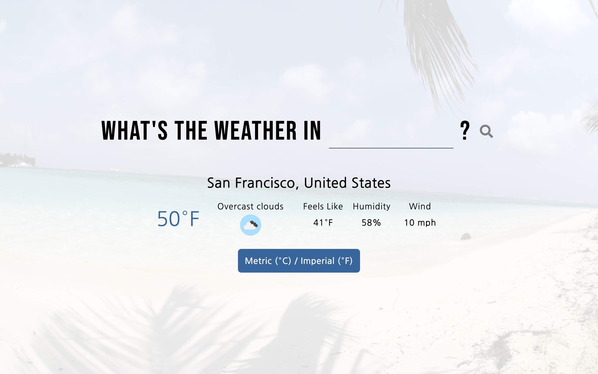
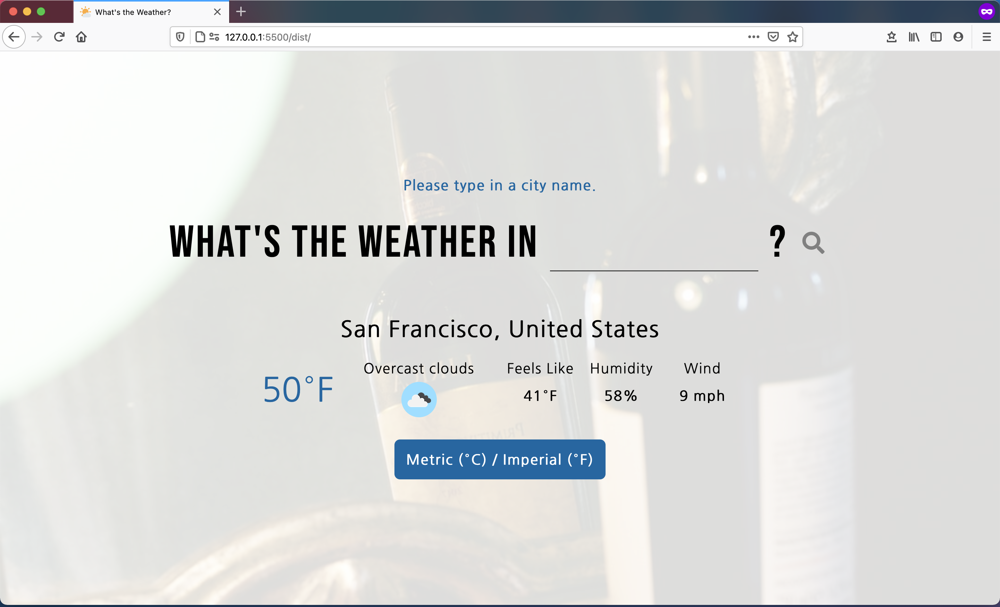
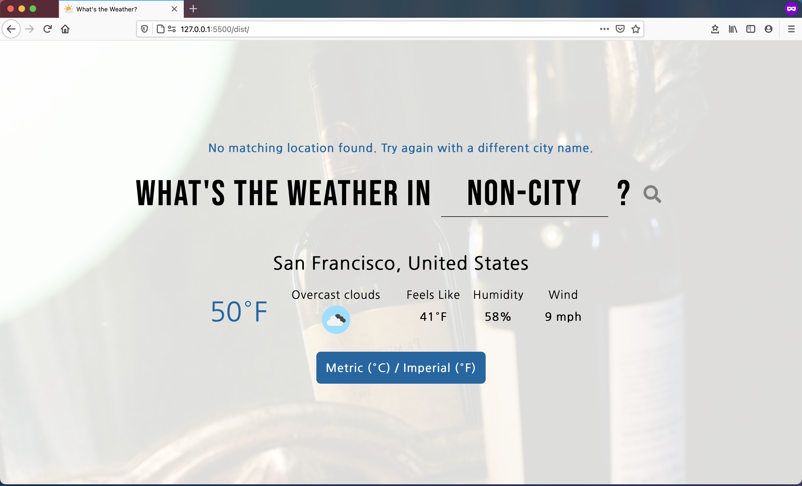
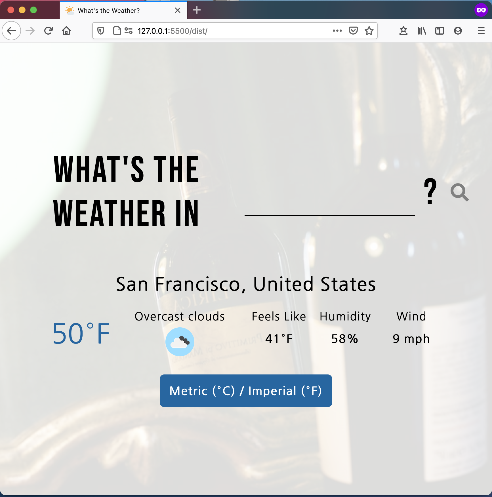
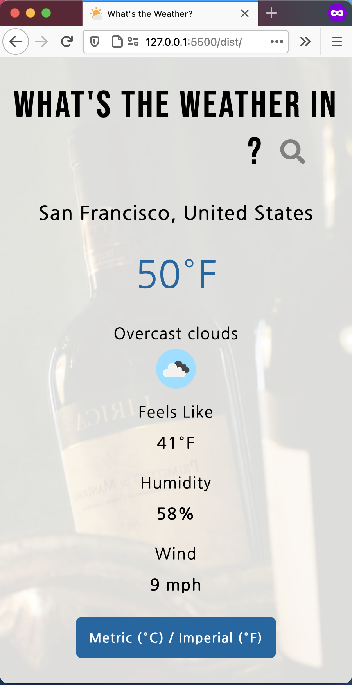

# weather-app 🌤

This weather app lets you search for cities and provide the current weather for the location.

## How to Use ☂️

To use the website, please create the `ApiKey.js` file in the same directory as `index.js` and store your own [OpenWeather](https://openweathermap.org/api) API Key inside the `OPEN_WEATHER_API_KEY` constant as well as your own [Unsplash](https://unsplash.com/documentation#creating-a-developer-account) API key inside the `UNSPLASH_API_KEY` constant. Place both constants inside the `ApiKey.js` file.

## Features 🖋

This weather app:

- [x] Provides the current weather data (temperature, perceived temperature, humidity, wind speed) for the user specified city
- [x] Displays different weather icons based on the weather descriptions
- [x] Alerts the user with error messages if the input is empty or the city does not exist
- [x] Toggles between metric and imperial unit system (celsius & m/s vs. fahrenheit & mph)
- [x] Changes the background image based on the user's city input
- [x] Informs the user of the full country name for the city, rather than an abbreviation
- [x] Utilizes the OpenWeather and Unsplash API for weather data and background image, respectively
- [x] Responds to different screen sizes such as tablet and cellphone

## Learning Outcomes 👩🏻‍💻

- [x] Practice Asynchronous JavaScript using Promises, Fetch API, Async/Await, .catch error handler
- [x] Understand how to use third party libraries and APIs by reading the documentation
- [x] Practice DOM manipulation and conditional rendering using JavaScript
- [x] Protect sensitive data such as API keys
- [x] Modularize code for better readability and the Single Responsibility Principle
- [x] Bundle modules using webpack5 and use webpack loaders and plugins

## Demo

### Weather App

### Demo Usage

### Handle the empty input error

### Handle the no-city-found error

### Responsive design - tablet size

### Responsive design - mobile size

